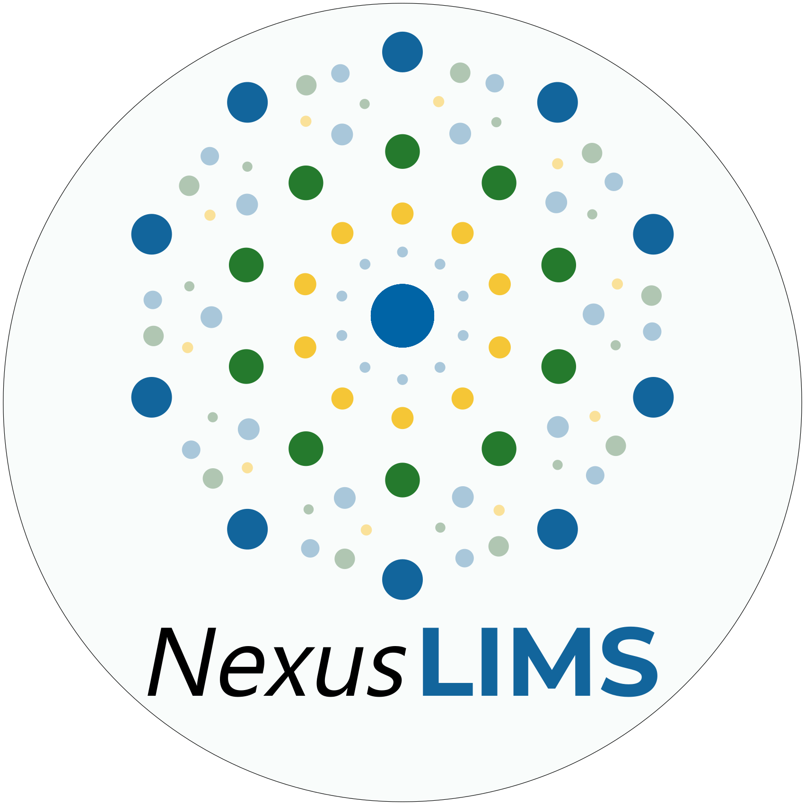

# Welcome to NexusLIMS!

The project serves as the development space for the ODI Nexus Microscopy Facility
Laboratory Information Management System (LIMS). The top level of the repository
holds a number of folders with files of various interest, but the majority of the
code that runs the LIMS system is contained within the [`nexusLIMS`](mdcs/nexusLIMS)
package. Additional information can be found in the
[project wiki](https://***REMOVED***nexuslims/NexusMicroscopyLIMS/wikis/home).

## Installation

To install the `nexusLIMS` package (in a reproducible manner), first install
Anaconda (the 
[`miniconda`](https://docs.conda.io/en/latest/miniconda.html) 
distribution is recommended). 
[Create](https://docs.conda.io/projects/conda/en/latest/user-guide/tasks/manage-environments.html#creating-an-environment-with-commands)
a new environment using the 
[`requirements.txt`](mdcs/nexusLIMS/requirements.txt) file by running

```bash
conda create -n nexus_env --file mdcs/nexusLIMS/requirements.txt -c conda-forge
``` 

from an Anaconda prompt. 
[Activate](https://docs.conda.io/projects/conda/en/latest/user-guide/tasks/manage-environments.html#creating-an-environment-with-commands) 
the `nexus_env` environment, clone this repository using `git`, and install 
the `nexusLIMS` package by running

```bash
pip install <path_to_repo>/mdcs/nexusLIMS
```  

## Basic use

Once the package is installed using `pip`, the code can be used like any other
Python library. For example, to extract the metadata from a `.tif` file saved
on the FEI Quanta, run the following code:

```python
from nexusLIMS.extractors.quanta_tif import get_quanta_metadata
get_quanta_metadata("path_to_file.tif")
``` 

To interact with the SharePoint Calendaring system for the Nexus Facility, the 
code expects that two variables are set in the environment: `nexusLIMS_user` and
`nexusLIMS_pass`. These should be a set of valid NIST credentials that have
access to the SharePoint system, and can be set prior to running any Python
code, 
[by the `conda` environment](https://conda.io/projects/conda/en/latest/user-guide/tasks/manage-environments.html#macos-and-linux),
or from within Python as shown in the example below:

```python
import os
from nexusLIMS.cal_harvesting import sharepoint_calendar as sc

os.environ['nexusLIMS_user'] = 'myUserName'
os.environ['nexusLIMS_pass'] = 'myPassword'

# Show the documentation for the get_events method:
print(sc.get_events.__doc__)

"""
    Get calendar events for a particular instrument on the Microscopy Nexus,
    on some date, or by some user

    Parameters:
    -----------
    instrument : None, str, or list of str
        One or more of ['msed_titan', 'quanta', 'jeol_sem', 'hitachi_sem',
        'jeol_tem', 'cm30', 'em400', 'hitachi_s5500', 'mmsd_titan',
        'fei_helios_db'], or None. If None, all instruments will be returned.

    date : None or str
        Either None or a YYYY-MM-DD date string indicating the date from
        which events should be fetched (note: the start time of each entry
        is what will be compared). If None, no date filtering will be
        performed. Date will be parsed by
        https://dateparser.readthedocs.io/en/latest/#dateparser.parse,
        but providing the date in the ISO standard format is preferred for
        consistent behavior.

    user : None or str
        Either None or a valid NIST username (the short format: e.g. "ear1"
        instead of ernst.august.ruska@nist.gov). If None, no user filtering
        will be performed. No verification of username is performed,
        so it is up to the user to make sure this is correct.

    Returns:
    --------
    output : string
        A well-formed XML document in a string, containing one or more <event>
        tags that contain information about each reservation, including title,
        instrument, user information, reservation purpose, sample details,
        description, and date/time information.
"""

# Get some events from the Titan microscope:
event_record = sc.get_events(instrument='msed_titan', date='2019-03-11')
print(event_record)

"""
Output:

<?xml version="1.0"?>
<events>
  <dateRetrieved>2019-03-26T09:29:52.598292</dateRetrieved>
    <event>
      <dateSearched>2019-03-11</dateSearched>
      <userSearched/>
      <title>***REMOVED***</title>
      <instrument>FEITitanTEM</instrument>
      <user>
        <userName>***REMOVED***</userName>
        <name>***REMOVED*** (Fed)</name>
        <email>michael.***REMOVED***@nist.gov</email>
        <phone>***REMOVED***</phone>
        <office>***REMOVED***</office>
        <link>https://***REMOVED***/***REMOVED***/_vti_bin/ListData.svc/UserInformationList(2815)</link>
        <userId>2815</userId>
      </user>
      <purpose>Lookin' for that martensite!</purpose>
      <sampleDetails>AM 17-4</sampleDetails>
      <description/>
      <startTime>2019-03-11T09:00:00</startTime>
      <endTime>2019-03-11T16:00:00</endTime>
      <link>https://***REMOVED***/***REMOVED***/_vti_bin/ListData.svc/FEITitanTEM(503)</link>
      <eventId>503</eventId>
    </event>
</events>
"""
``` 


## Contributing 

To contribute, please [fork](https://***REMOVED***nexuslims/NexusMicroscopyLIMS/forks/new)
the repository, develop your addition on a
[feature branch](https://www.atlassian.com/git/tutorials/comparing-workflows/feature-branch-workflow)
within your forked repo,
and submit a [merge request](https://***REMOVED***nexuslims/NexusMicroscopyLIMS/merge_requests)
to the [`master`](https://***REMOVED***nexuslims/NexusMicroscopyLIMS/tree/master)
branch to have it included in the project.
This project uses testing through the 
[`pytest`](https://docs.pytest.org/en/latest/) library, and strives for 
100% coverage of all code within the Python package. 
Please ensure that any new code is fully tested (see the 
[`tests`](mdcs/nexusLIMS/nexusLIMS/tests) package for examples) and that the 
coverage of any new features is 100%. To get this information, you can use an 
IDE that includes coverage tracking (such as 
[PyCharm](https://www.jetbrains.com/pycharm/)) or include the `--cov` flag when
running the tests. For example:

```bash
cd <path_to_repo>/mdcs/nexusLIMS
pytest --cov=nexusLIMS nexusLIMS/tests

# Output: 
# =============================== test session starts ===============================
# platform linux -- Python 3.6.8, pytest-4.3.0, py-1.8.0, pluggy-0.9.0
# rootdir: ***REMOVED***NexusMicroscopyLIMS/mdcs/nexusLIMS/nexusLIMS/tests, inifile: pytest.ini
# plugins: cov-2.6.1
# collected 29 items
# 
# nexusLIMS/tests/test_calendar_handling.py ...........................       [ 93%]
# nexusLIMS/tests/test_metadata_extractors.py .                               [ 96%]
# nexusLIMS/tests/test_version.py .                                           [100%]
# 
# ----------- coverage: platform linux, python 3.6.8-final-0 -----------
# Name                                              Stmts   Miss  Cover
# ---------------------------------------------------------------------
# nexusLIMS/__init__.py                                 0      0   100%
# nexusLIMS/cal_harvesting/__init__.py                  0      0   100%
# nexusLIMS/cal_harvesting/sharepoint_calendar.py      93      0   100%
# nexusLIMS/extractors/__init__.py                      1      0   100%
# nexusLIMS/extractors/quanta_tif.py                    6      0   100%
# nexusLIMS/tests/test_calendar_handling.py           137      0   100%
# nexusLIMS/tests/test_metadata_extractors.py          36      0   100%
# nexusLIMS/tests/test_version.py                       5      0   100%
# nexusLIMS/version.py                                  1      0   100%
# ---------------------------------------------------------------------
# TOTAL                                               279      0   100%
# 
# 
# =========================== 29 passed in 12.64 seconds ============================
```

## About the logo

The logo for the NexusLIMS project is inspired by the Nobel Prize
[winning](https://www.nobelprize.org/prizes/chemistry/2011/shechtman/facts/) 
work of 
[Dan Shechtman](https://www.nist.gov/content/nist-and-nobel/nobel-moment-dan-shechtman)
during his time at NIST in the 1980s. Using transmission electron diffraction,
Shechtman measured an unusual diffraction pattern that ultimately overturned
a fundamental paradigm of crystallography. He had discovered a new class of 
crystals known as 
[*quasicrystals*](https://en.wikipedia.org/wiki/Quasicrystal), which have a 
regular structure and diffract, but are not periodic.

We chose to use Shechtman's 
[first published](https://journals.aps.org/prl/pdf/10.1103/PhysRevLett.53.1951) 
diffraction pattern of a quasicrystal as inspiration for the NexusLIMS logo 
due to its significance in the electron microscopy and crystallography 
communities, together with its storied NIST heritage:  
 
 :arrow\_right: 

<!-- Comment for git flow testing  -->