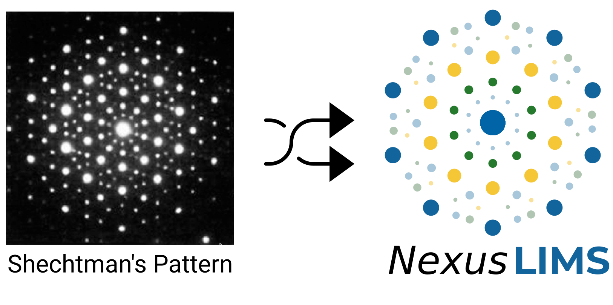

Welcome to NexusLIMS!
=====================

The project serves as the development and documentation space for the back-end
of the Nexus Microscopy Facility Laboratory Information Management System
(LIMS), developed by the NIST ADLP Research Data and Computing Office in coordination
with the Material Measurement Laboratory Data Division.
This documentation contains a number of pages that detail the processes by
which NexusLIMS harvests and combines data from multiple sources to build
a record of an experiment on a Nexus facility microscope.

Documentation overview
----------------------

The :doc:`database <database>` page describes how information about instruments
and recorded sessions is stored. The :doc:`record building <record_building>`
page provides a detailed description of how a record of a given experiment
is built from beginning to end.
There is also additional documentation about the practices used
in :doc:`developing NexusLIMS <development>`, the
:doc:`taxonomy <taxonomy>` used when discussing NexusLIMS, the
:doc:`schema <schema_documentation>` used to represent Experiment records,
and :doc:`customizations <customizing_cdcs>` that were made to
the `CDCS <https://cdcs.nist.gov>`_ platform to create the NexusLIMS front-end.
Finally, there is detailed :doc:`API documentation <api>` for every method
used in the NexusLIMS back-end.

Most typical users will have no reason to interact with the NexusLIMS back-end
directly, since it operates completely automatically and builds experimental
records without any need for user input. These pages serve mostly as reference
for those with more interest in the nuts and bolts of how it all works together,
and how the system may be able to be changed in the future.

.. _logo:

About the logo
--------------

The logo for the NexusLIMS project is inspired by the Nobel Prize
`winning <https://www.nobelprize.org/prizes/chemistry/2011/shechtman/facts/>`__
work of `Dan
Shechtman <https://www.nist.gov/content/nist-and-nobel/nobel-moment-dan-shechtman>`__
during his time at NIST in the 1980s. Using transmission electron
diffraction, Shechtman measured an unusual diffraction pattern that
ultimately overturned a fundamental paradigm of crystallography. He had
discovered a new class of crystals known as
`quasicrystals <https://en.wikipedia.org/wiki/Quasicrystal>`__, which
have a regular structure and diffract, but are not periodic.

We chose to use Shechtman’s `first
published <https://journals.aps.org/prl/pdf/10.1103/PhysRevLett.53.1951>`__
diffraction pattern of a quasicrystal as inspiration for the NexusLIMS
logo due to its significance in the electron microscopy and
crystallography communities, together with its storied NIST heritage:

About the NexusLIMS team
------------------------

NexusLIMS has been developed through a great deal of work by a number of people
including:

- `June Lau <https://www.nist.gov/people/june-w-lau>`_ - Research Data and Computing Office/ CHIPS Metrology
- `Gretchen Greene <https://www.nist.gov/people/gretchen-greene>`_ - Research Data and Computing Office
- `Ryan White <https://www.nist.gov/people/ryan-white>`_ - Applied Chemicals and Materials Division / Office of Data and Informatics (detail)
- `Michael Katz <https://www.nist.gov/people/michael-katz>`_ - Materials Science and Engineering Division / Office of Data and Informatics (detail)
- `Marcus Newrock <https://www.nist.gov/people/marcus-william-newrock>`_ - Office of Data and Informatics
- `Ray Plante <https://www.nist.gov/people/raymond-plante>`_ - Office of Data and Informatics
- `Hamza Bouhanni <https://www.nist.gov/people/hamza-bouhanni>`_ - Prometheus Computing / Research Data and Computing Office
- `Katelyn Jones <https://www.nist.gov/people/katelyn-jones>`_ - Data Science and AI Group
- `Benjamin Long <https://www.nist.gov/people/benjamin-long>`_ - Applied AI Research Group
- `Joshua Taillo` - Previous NIST employee

As well as multiple SURF students/undergraduate interns:

- Rachel Devers - Montgomery College/University of Maryland College Park
- Thomas Bina - Pennsylvania State University
- Sarita Upreti - Montgomery College
